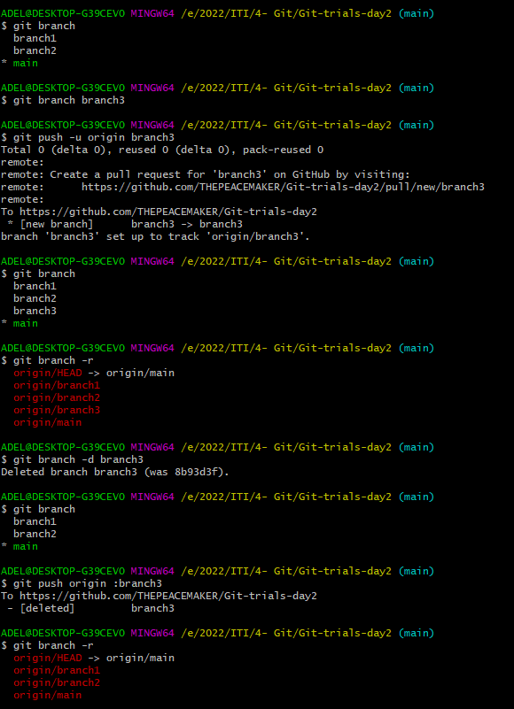
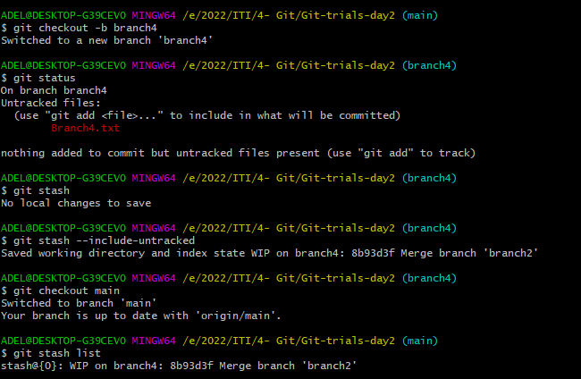
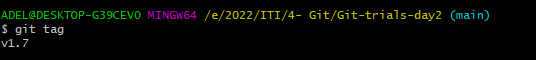
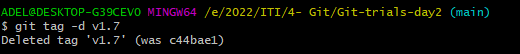
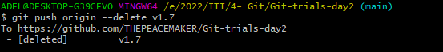

# Git-trials-day2

## ScreenShots

### Features I needed to add
- how to remove branches locally and remotely
	
	

- how to checkout another branch without commit changes 
	
	

- how to list tags
	
	
- how to delete tag locally and remotely
	- localy 

		
	- remotly

		